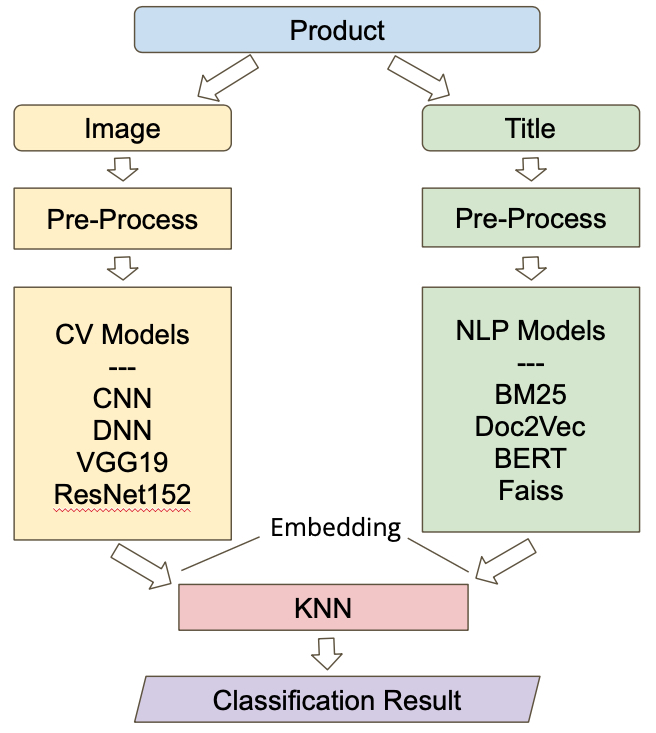
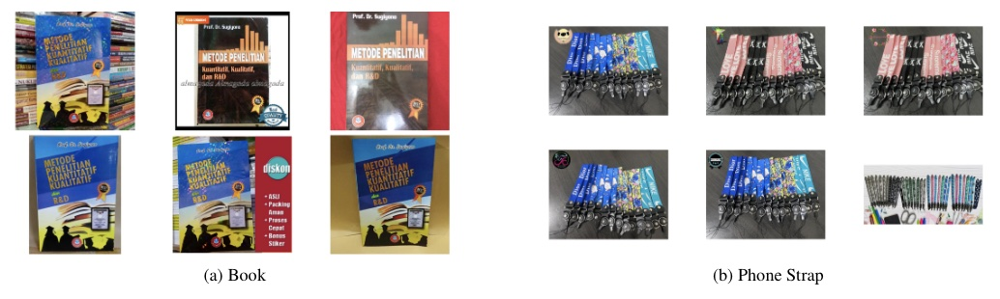
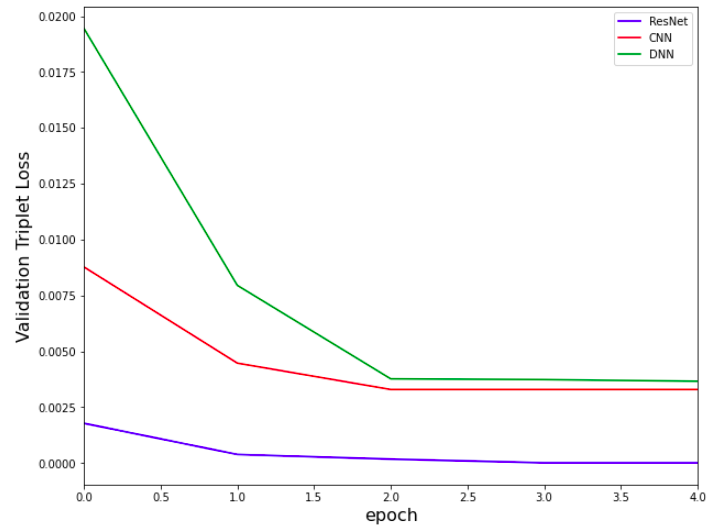
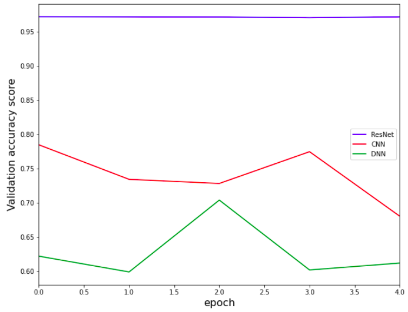

# DL Project: Shopee Product Match

**Authors:** Yifei Li, Waleed Algadhi

Uses deep learning techniques in CV and NLP to catch the same product on e-commerce platform Shopee (Source: [Kaggle](https://www.kaggle.com/c/shopee-product-matching/overview)).

For more detail, see the [report](./Shopee_Product_Match_Report.pdf)

## Problem Formulation:

Each product has an image and a short title description. We're trying to match all of the duplicates.

In total, we have 32,412 training data and 70,000 test data. For more information, see the [data introduction](https://www.kaggle.com/c/shopee-product-matching/data).

## Models

Natural language processing and computer vision

## Results

The higest accuracy is 97%.

## Matching Products

## Evaluations

  

  

