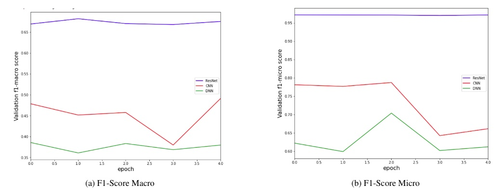

# DL Project: Shopee Product Match

**Authors:** Yifei Li, Waleed Algadhi

Uses deep learning techniques in CV and NLP to catch the same product on e-commerce platform Shopee (Source: [Kaggle](https://www.kaggle.com/c/shopee-product-matching/overview)).

For more detail, see the [report](report.pdf) and [notebooks](/notebooks).

## Problem Formulation:

Each product has an image and a short title description. We're trying to match all of the duplicates.

In total, we have 32,412 training data and 70,000 test data, with around 10,000 classes. For more information, see the [data introduction](https://www.kaggle.com/c/shopee-product-matching/data).

## Models

Zero-shot learning, natural language processing, computer vision, and triplet loss function.

Notes: VGG and Faiss are not finished due to the time limitation.

## Results

The higest accuracy is **97%**

### Matching Products

### Evaluations

